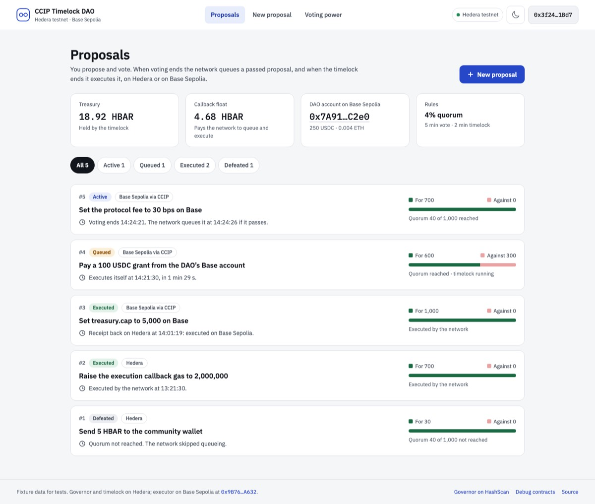
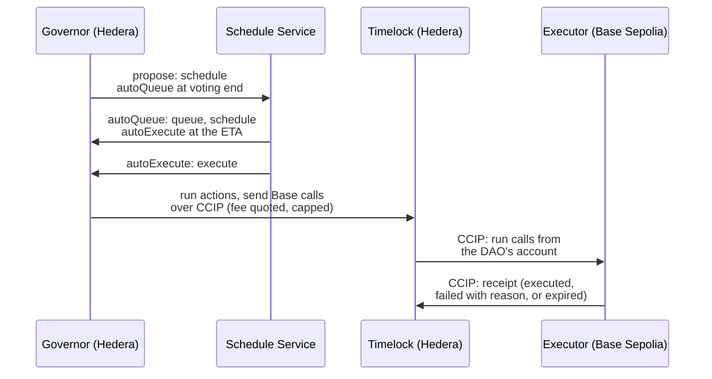

# hedera-ccip-timelock-dao

[](https://hedera-ccip-timelock-dao-docs.vercel.app) **[Docs site](https://hedera-ccip-timelock-dao-docs.vercel.app)** · **[Live demo](https://hedera-ccip-timelock-dao.vercel.app)**

A [Scaffold-HBAR](https://github.com/hedera-dev/create-scaffold-hbar) template for a token-governed DAO on Hedera whose proposals queue and execute themselves, on Hedera or on Base Sepolia.

- **Vote with an HTS token, safely.** Holders wrap the HTS governance token 1:1 into an `ERC20Votes` token, so each vote counts the balance at the proposal's snapshot. Tokens bought after a vote opens cannot vote on it. ([Why wrap to vote](docs/wrap-to-vote.md))
- **No keeper.** Creating a proposal asks the Hedera Schedule Service (HIP-1215) to call the governor back when voting ends; that call queues the proposal and schedules the one that executes it when the timelock ends. If a scheduled call fails, anyone can finish the job from the app.
- **Cross-chain actions with receipts.** A proposal can include calls on Base Sepolia. They travel in one Chainlink CCIP message, run from the DAO's own account there, and a receipt comes back to Hedera saying whether they ran. The CCIP fee is quoted at execution and capped by the vote.



*The live testnet DAO ([PROOFS.md](PROOFS.md)). [Every page and state](docs/frontend.md) is also tested with fixture data at 1440 and 390 px in light and dark.*

## Live on testnet

A DAO made from this template runs on Hedera testnet. **[Live demo](https://hedera-ccip-timelock-dao.vercel.app)**: the app, deployed on Vercel against that DAO, so you can look around or take part from a browser with no setup. A freshly scaffolded project opens the same DAO: `packages/nextjs/contracts/daoDeployment.ts` points at it until you deploy your own. Anyone can use it, so its proposals and balances keep changing.

| Hedera testnet | Address | Source |
|---|---|---|
| `DaoGovernor` | [0x7d1e2fa702d137b019c44b9a562e04dd89cf7468](https://hashscan.io/testnet/contract/0x7d1e2fa702d137b019c44b9a562e04dd89cf7468) | [Sourcify](https://repo.sourcify.dev/296/0x7d1e2Fa702d137B019c44b9A562e04DD89CF7468) |
| `DaoTimelock` (treasury) | [0xa895bf23411339f0bc19ee7859be455dcfb57d18](https://hashscan.io/testnet/contract/0xa895bf23411339f0bc19ee7859be455dcfb57d18) | [Sourcify](https://repo.sourcify.dev/296/0xa895Bf23411339f0Bc19Ee7859be455DCfB57D18) |
| `VoteToken` (vHGOV) | [0x12a964056dbc26ad3206f03191daa7cf5d8c6bfa](https://hashscan.io/testnet/contract/0x12a964056dbc26ad3206f03191daa7cf5d8c6bfa) | [Sourcify](https://repo.sourcify.dev/296/0x12A964056dBC26aD3206F03191dAa7cf5d8C6BFa) |
| `GovTokenFaucet` | [0xc3467144fea2d32329cb42d95e5190355834749a](https://hashscan.io/testnet/contract/0xc3467144fea2d32329cb42d95e5190355834749a) | [Sourcify](https://repo.sourcify.dev/296/0xc3467144fEA2d32329cb42D95E5190355834749a) |
| HGOV | HTS token `0.0.10822898` | |

| Base Sepolia | Address | Source |
|---|---|---|
| The DAO's account (a minimal clone of `DaoAccount`) | [0xa0E81699e1BC4f571d90A941b01420796192B124](https://sepolia.basescan.org/address/0xa0E81699e1BC4f571d90A941b01420796192B124) | [Sourcify](https://repo.sourcify.dev/84532/0x9Bca21242bE1A189450f92BC064F2AA230D2c68F) (implementation) · [Blockscout](https://base-sepolia.blockscout.com/address/0xa0E81699e1BC4f571d90A941b01420796192B124) (proxy; its implementation's source) |
| `CrossChainExecutor`, shared by every DAO from this template | [0x9B7691B0766A55D8509b07Cb633Ce281feE2A632](https://sepolia.basescan.org/address/0x9B7691B0766A55D8509b07Cb633Ce281feE2A632) | [Sourcify](https://repo.sourcify.dev/84532/0x9B7691B0766A55D8509b07Cb633Ce281feE2A632) · [Blockscout](https://base-sepolia.blockscout.com/address/0x9B7691B0766A55D8509b07Cb633Ce281feE2A632) |
| `RemoteParameters`, shared demo target | [0x5f8b11a830ce09d87fA586c95e7C85FA57691cd9](https://sepolia.basescan.org/address/0x5f8b11a830ce09d87fA586c95e7C85FA57691cd9) | [Sourcify](https://repo.sourcify.dev/84532/0x5f8b11a830ce09d87fA586c95e7C85FA57691cd9) · [Blockscout](https://base-sepolia.blockscout.com/address/0x5f8b11a830ce09d87fA586c95e7C85FA57691cd9) |

[PROOFS.md](PROOFS.md) records six proposals run through the app by four voters, each queued by the network and then executed by it with no keeper, or, for the fee-cap case, stopped: a Hedera-only payment, a fee cap that stopped an execution, a parameter set on Base Sepolia, and three USDC payouts from the DAO's Base account (the last two filmed for the demo video), the last four with their receipts back on Hedera. CI re-checks every on-chain link in these docs daily (`npm run check:proofs`).

**Try it with only Hedera testnet HBAR.** Scaffold the template ([Quick start](#quick-start)) and follow [Take part with a testnet wallet](#take-part-with-a-testnet-wallet). The DAO pays for the network's queue and execute calls and for CCIP fees; you pay about 3 HBAR of gas for the whole run. One faucet claim (1,000 HGOV, wrapped into 1,000 vHGOV) passes a proposal on its own while fewer than 25,000 vHGOV exist (quorum is 4%).

## Quick start

You need:

- Node 20.18.3 or later.
- A Git user name and email that apply in the folder you run the CLI from. The CLI reads `git config user.name` and `user.email` there before it creates a repository, so set a global identity (`git config --global user.name "…"` and `git config --global user.email "…"`). If an `includeIf` rule supplies your identity instead, create a repository under the path the rule matches and run the CLI inside it: `mkdir work && cd work && git init`, check with `git config user.email`, then scaffold there. The project gets its own repository inside `work`; delete `work/.git` afterwards if you like.
- Foundry: install it with `curl -L https://foundry.paradigm.xyz | bash`, then run `foundryup`. `make` must be available too (on macOS it comes with the Xcode command line tools). Any version from 1.4 builds, tests and deploys; `npm run lint` needs 1.8.4 or later (`foundryup --install 1.8.4`). Before 1.8.4, `npm run build` (which compiles the contracts) prints harmless `unknown id` warnings for lint rules that version does not know.

Scaffold and run the template with npm, and leave the CLI's `--package-manager` option at its default; other package managers are not supported.

```bash
npx create-scaffold-hbar@latest my-dao --template Baskarayelu/hedera-ccip-timelock-dao
cd my-dao
npm run next:dev
```

The CLI asks whether to add the Hedera Skills agent guides (either answer works) and which network to use: choose **Testnet**. It installs the dependencies itself. Any deprecation warning printed while the CLI itself downloads (for example for `tar`) comes from its own dependencies and is harmless. To skip the questions, as CI and coding agents must, add `--yes --skip-hedera-skills --network testnet` after the template.

Open http://localhost:3000 (if that port is taken, Next.js uses the next free one and prints it). Each page compiles on its first visit, the first one for up to a minute or two; after that, pages load in seconds. The app opens the live testnet DAO; its proposals load in the browser.

To use npm's `create` command instead, write `create scaffold-hbar@latest my-dao -- --template Baskarayelu/hedera-ccip-timelock-dao` after `npm`: the `--` passes the flags through to the CLI. The non-interactive flags go at the end, after the template: `… -- --template Baskarayelu/hedera-ccip-timelock-dao --yes --skip-hedera-skills --network testnet`.

### Take part with a testnet wallet

1. **Get a testnet account.** Create an ECDSA account at [portal.hedera.com](https://portal.hedera.com) and fund it from the [faucet](https://portal.hedera.com/faucet). About 10 HBAR covers every step below; they spend about 3 ([Costs](docs/costs.md)). Add Hedera testnet to your wallet (chain id 296, RPC `https://testnet.hashio.io/api`, currency symbol HBAR, explorer `https://hashscan.io/testnet`) and import the account's private key in its HEX form (the portal shows HEX and DER; wallets take the HEX one). The app's burner wallet is for looking around: it starts with no HBAR and no Hedera account, so it can act only after you send HBAR to its address from the faucet.
2. **Voting power** page: it lists four steps. The first, associating HGOV, is marked *Not needed* for accounts that associate automatically: one created at portal.hedera.com or by sending HBAR to a new address does. An account created another way (for example with an SDK, which defaults to no free slots) needs it; the page tells you which case yours is. Then press **Claim** to get 1,000 HGOV from the DAO's own faucet (once per account every 24 hours), **Approve and wrap** to turn them into vHGOV (two wallet confirmations), and **Delegate to myself**: four confirmations in all. A wallet with no Hedera account yet sees the steps waiting until it is funded.
3. **New proposal**: add a Base action such as *Set a parameter*. The page quotes the CCIP fee live and proposes a cap of twice the quote, rounded up to the next 0.01 HBAR (the quote is shown cut to two decimals, so the cap can read up to 0.02 more than twice it). Submit.
4. **Vote** on the proposal's page once voting opens, 1 minute after you propose; voting stays open for 5 minutes. (The page's clock times may show a second or two less, such as 59 s, because the contracts count from Hedera's block clock, which trails consensus time by about 2 s, at most 3 s.) Then watch it: the network queues it 5 seconds after voting ends and executes it 2 minutes later (the timelock), about 8 minutes after you proposed. A Base action runs on Base Sepolia within a minute of that, and its receipt reaches Hedera once Base Sepolia finalizes the block, which took 19 to 24 minutes during our runs; the page estimates it live. The timeline links each step to HashScan, the CCIP explorer and Basescan.

### Deploy your own DAO

The deploy uses the executor already on Base Sepolia, so you need only testnet HBAR, about 57 in all: 22 for the contracts and the token, 15 for the callback float (the HBAR the governor pays the network with when it queues and executes proposals) and 20 for the treasury. The 22 includes creating the token, which sends 30 HBAR with its call and gets about 18 back, so have at least 60 on hand when you start. See [Costs](docs/costs.md).

```bash
npm run foundry:account:generate   # writes a fresh key to packages/foundry/.env
# fund the printed address at https://portal.hedera.com/faucet
npm run foundry:deploy:hedera      # token, vote token, timelock, governor, wiring, funding
npm run foundry:export             # points the frontend at your DAO
npm run foundry:verify:hedera      # publishes the contracts' source on Sourcify, so HashScan shows it
```

To deploy from an existing testnet key, put `DEPLOYER_PRIVATE_KEY=0x…` in `.env.local` at the repository root instead; it takes precedence over `packages/foundry/.env`. Both files are gitignored. Voting periods, quorum, gas limits and HBAR amounts are set in `packages/foundry/.env`, which installing copies from `packages/foundry/.env.example`.

The script prints the DAO's account address on Base Sepolia. Fund it with Base Sepolia ETH to pay for its own receipts (while it holds too little, the executor's sponsor pool, shared by every DAO, pays for up to ten while it has funds), and with any tokens the DAO should control there.

## How it works



[Architecture](docs/architecture.md) covers the contracts, the full sequence and the frontend's data layer. [Threat model](docs/threat-model.md) lists what is protected and how, including what is demo-only.

### If a scheduled call fails

A scheduled call runs once. If it fails, the proposal's page says why (for example a CCIP fee above the cap the proposal was voted with, a treasury too small for its transfers plus the fee, or a callback float too low to pay the network) and offers two ways on:

- **Schedule it again** asks the network to try once more. Your wallet pays to schedule it; the float pays for the run.
- **Queue now** or **Execute now** does the step straight from your wallet.

Before sending either, the app estimates the transaction: if it would revert with a reason the DAO's contracts define (such as `FeeAboveCap`), the page shows that reason and sends nothing, and a wallet with no Hedera account yet is asked to fund it first. While a proposal's fee is still above its cap, *Schedule it again* is unavailable, because the retry would stop the same way. The Proposals page warns when the float is too low for the next call, and anyone can top it up by sending HBAR to the governor. [Costs](docs/costs.md#callback-gas-limits) explains what the float must hold.

## Project layout

| Path | What |
|---|---|
| `packages/foundry/contracts/hedera/` | `DaoGovernor`, `DaoTimelock`, `VoteToken`, `GovTokenFaucet`, `HssScheduler` |
| `packages/foundry/contracts/remote/` | `CrossChainExecutor`, `DaoAccount`, `RemoteParameters` (Base Sepolia) |
| `packages/foundry/test/` | Forge tests and the HSS, CCIP and mirror-node test doubles |
| `packages/foundry/scripts-js/` | Deploy and export scripts (viem) |
| `packages/foundry/deployments/` | Committed deployment records |
| `packages/nextjs/` | The app: pages in `components/dao/pages`, data layer in `lib/dao`, tests in `e2e/` |

## Commands

Run these from the repository root.

| Command | What it does |
|---|---|
| `npm run next:dev` | The app at http://localhost:3000 |
| `npm run test` | 60 Foundry tests and the frontend's data-layer tests |
| `npm run next:test:e2e` | Every page and state in the browser (run `npx playwright install chromium` once first). It builds into `packages/nextjs/.next-e2e` and serves on port 3100; if that port is busy it stops at once and says so: set `E2E_PORT` to another port. |
| `npm run lint` | ESLint and Prettier, `forge fmt`, `forge lint` (Foundry 1.8.4 or later), and the docs check. Next.js prints a notice that `next lint` is deprecated; it needs no action. |
| `npm run build` | Compile the contracts and build the app |
| `npm run foundry:account:generate` | Write a fresh testnet deployer key to `packages/foundry/.env` and print its address |
| `npm run foundry:deploy:hedera` | Deploy a DAO to Hedera testnet |
| `npm run foundry:verify:hedera` | Verify the deployed DAO's contracts on Sourcify |
| `npm run foundry:export` | Regenerate the app's ABIs and addresses from `packages/foundry/deployments` |
| `npm run check:proofs` | Re-verify every HashScan, CCIP explorer, Basescan and Sourcify link in the docs |
| `npm run check:mermaid` | Render every Mermaid diagram in the docs in Chromium, failing on one that breaks or is too wide to read (needs `npx playwright install chromium` once, like the e2e tests) |

## Docs

- [Docs site](https://hedera-ccip-timelock-dao-docs.vercel.app): this README, the docs below and PROOFS.md as one searchable site
- [Architecture](docs/architecture.md): contracts, a proposal's life, the frontend's data layer
- [Why wrap to vote](docs/wrap-to-vote.md): HTS has no vote checkpoints, and what that means
- [Threat model](docs/threat-model.md): assets, trust, attacks and mitigations
- [Frontend](docs/frontend.md): pages, states, live data and tests
- [Hedera, CCIP and CLI gotchas](docs/gotchas.md): behaviour measured on testnet that shaped the design
- [Costs](docs/costs.md): how Hedera bills gas, and what each step, proposal and deployment costs, measured
- [AGENTS.md](AGENTS.md): briefing for coding agents working in a scaffolded project

## Licence

MIT. Built on the Scaffold-HBAR blank template (MIT, BuidlGuidl and hedera-dev).
