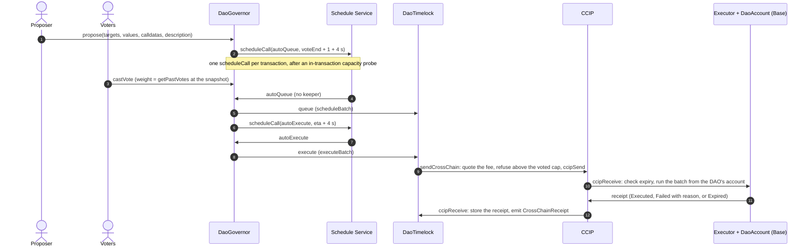
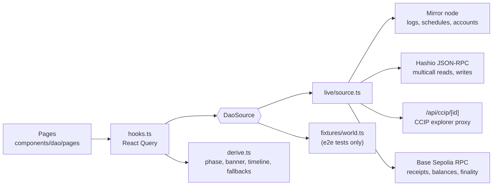

# Architecture

The DAO lives on Hedera testnet. It can act on Hedera directly and on Base Sepolia through Chainlink CCIP. No off-chain keeper is involved at any step: the Hedera Schedule Service (HSS, HIP-1215) calls the governor back at the right second.

## Contracts

```mermaid
flowchart LR
  subgraph Hedera testnet
    HGOV[["HGOV<br/>HTS fungible token"]]
    Faucet["GovTokenFaucet<br/>creates HGOV, demo claims"]
    Votes["VoteToken (vHGOV)<br/>ERC20Wrapper + ERC20Votes"]
    Gov["DaoGovernor<br/>OZ Governor + HssScheduler"]
    TL["DaoTimelock<br/>treasury, CCIP outbox, receipt inbox"]
    HSS(("HSS 0x16b"))
    RouterH(("CCIP Router"))
  end
  subgraph Base Sepolia
    RouterB(("CCIP Router"))
    Exec["CrossChainExecutor<br/>shared by every DAO"]
    Acct["DaoAccount<br/>this DAO's clone"]
    Target["RemoteParameters, USDC, ..."]
  end
  Faucet -- mints --> HGOV
  HGOV -- wrap 1:1 --> Votes
  Votes -- getPastVotes at snapshot --> Gov
  Gov -- scheduleCall --> HSS
  HSS -- autoQueue / autoExecute --> Gov
  Gov -- queue / execute --> TL
  TL -- sendCrossChain: getFee, ccipSend --> RouterH
  RouterH -. CCIP .-> RouterB
  RouterB -- ccipReceive --> Exec
  Exec -- executeCalls --> Acct
  Acct -- calls --> Target
  Exec -- receipt --> RouterB
  RouterB -. CCIP .-> RouterH
  RouterH -- ccipReceive --> TL
```

| Contract | Chain | Role |
|---|---|---|
| `GovTokenFaucet` | Hedera | Creates HGOV through the HTS system contract (0x167) with itself as treasury and supply key, and no admin, freeze, wipe, KYC, pause or fee keys. Hands out demo amounts with a cooldown. |
| `VoteToken` | Hedera | Wraps HGOV 1:1 into vHGOV, an `ERC20Votes` token on a timestamp clock. Voting weight lives here because HTS transfers run no contract code. See [Why wrap to vote](wrap-to-vote.md). |
| `DaoGovernor` | Hedera | OpenZeppelin Governor (settings, simple counting, votes, quorum fraction, timelock control) plus `HssScheduler`. Schedules its own queue and execute calls and pays for them from an HBAR float it holds. |
| `DaoTimelock` | Hedera | OpenZeppelin `TimelockController` that holds the treasury, sends call batches over CCIP (`sendCrossChain`) and records the receipts that come back. |
| `CrossChainExecutor` | Base Sepolia | Receives requests from any DAO on any CCIP chain. Runs each batch from that DAO's own `DaoAccount` clone and sends a receipt back. Deployed once and shared. |
| `DaoAccount` | Base Sepolia | A minimal clone per (source chain, source DAO). It holds the DAO's funds on Base and is the `msg.sender` its calls come from. |
| `RemoteParameters` | Base Sepolia | Demo target: a key-value store namespaced by caller. |

## A proposal's life

Details that matter:

- **Every network call is a self-call.** HSS runs the scheduled call with `msg.sender == address(this)`, and `autoQueue`/`autoExecute` refuse anything else. `autoExecute` calls the governor's own `execute`, so `onlyGovernance` targets behave exactly as with a manual execute.
- **The 4-second margin.** On Hedera `block.timestamp` is the start of the record-file block, up to about 3 s before the transaction's consensus time. A callback that must see `block.timestamp > voteEnd` is therefore scheduled at `voteEnd + 1 + BLOCK_CLOCK_MARGIN` (4 s).
- **Nothing reverts the governance action.** If the schedule service is busy or unavailable, `propose` and `queue` still succeed and emit `AutoActionUnavailable`. A callback that fails emits `AutoActionFailed` with the revert data. `queue`, `execute` and `rearm` stay permissionless, so anyone can finish the job, and the frontend offers both.
- **The fee is quoted at execution.** The proposal carries a fee cap that voters approve. `sendCrossChain` quotes the CCIP fee when it runs and reverts with `FeeAboveCap(fee, cap)` above it. The whole execution then reverts, so Hedera actions in the same proposal do not run either.
- **Receipts close the loop.** The executor reports `Executed`, `Failed` (with the first 256 bytes of the revert reason) or `Expired`. The timelock accepts a receipt only from the executor registered for that chain, only for a request it sent, and only once.

## The frontend

`packages/nextjs` is a Next.js App Router app with four pages: Proposals (`/`), New proposal (`/proposals/new`), a proposal's detail (`/proposals/<id>`) and Voting power (`/voting-power`). The Debug page from Scaffold-HBAR stays at `/debug`.

- **One data interface, two implementations.** `DaoSource` (in `lib/dao/source.ts`) returns raw records: decoded events, contract state, schedule results and cross-chain status. The live implementation reads the chain. The fixture implementation is a small simulator of the governor, timelock, schedule service and CCIP that the end-to-end tests drive. `derive.ts` turns either into what the pages show, so the tests exercise the same logic the live app runs.
- **Every number is read.** Fees come from the CCIP router's `getFee`, rules and balances from contract reads, timings from the mirror node, and the receipt estimate from Base Sepolia's finalized head plus how long this DAO's recent receipts took. Nothing in the pages is a constant.
- **Writes** go out as legacy transactions at `eth_gasPrice` with explicit gas limits (see [Hedera, CCIP and CLI gotchas](gotchas.md)). Before sending, the app estimates gas; if the estimate reverts with an error the DAO's contracts define (for example `FeeAboveCap`), it shows that reason instead of spending gas on a transaction that would fail.
