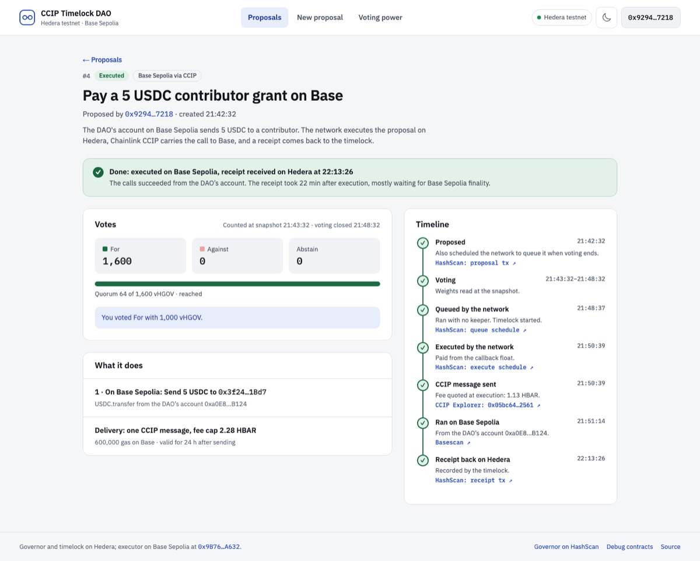
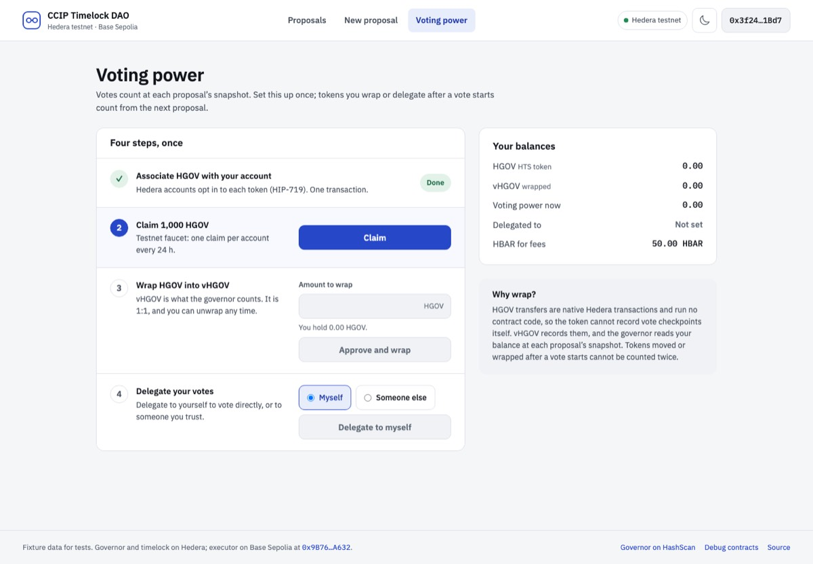

# Frontend

`packages/nextjs` is a Next.js App Router app (wagmi, viem, RainbowKit, React Query). It has four pages, and every value on them is read from the chain.

| Page | Route | What it does |
|---|---|---|
| Proposals | `/` | Treasury, callback float, the DAO's Base account and the rules; every proposal with its state, what happens next and its tally. |
| New proposal | `/proposals/new` | Title, description and actions on Hedera (send HBAR or HGOV, call a contract) and on Base Sepolia (set a parameter, send USDC or ETH, call a contract). For Base actions: the live CCIP fee, the fee cap you vote for (twice the quote by default) and the gas on Base. Shows when each step will happen, what proposing costs, and a preview of the exact calls. |
| Proposal | `/proposals/<id>` | Votes and your voting power at the snapshot, the decoded actions, a timeline with HashScan, CCIP explorer and Basescan links, and the fallback actions (Queue now, Execute now, Schedule it again). |
| Voting power | `/voting-power` | Associate, claim, wrap (with an amount) and delegate (to yourself or another address), plus balances and unwrap. |



## States

Each proposal's state comes from `lib/dao/derive.ts`, which reads raw records: the governor's events, its `state()`, the schedule service's results on the mirror node, the CCIP explorer, the executor's `RequestProcessed` on Base and the timelock's `CrossChainReceipt` on Hedera.

| State | How it is detected | What the page offers |
|---|---|---|
| Pending | `state()` is Pending | When voting opens; the proposer can cancel |
| Voting open | `state()` is Active | For / Against / Abstain with your votes at the snapshot |
| No voting power at the snapshot | Active, and `getPastVotes(you, snapshot)` is 0 | Why, and that wrapping and delegating now counts from the next proposal |
| Passed, queueing | Succeeded and the queue callback is due within 45 s | The second the network queues it |
| Queue call failed | Succeeded, and the callback failed, was skipped, could not be scheduled, or ran out of float | The reason; Queue now and Schedule it again |
| Queued | Queued, before the execute callback is due | The second it executes itself, with a countdown |
| Fee above the voted cap | The execute callback failed with `FeeAboveCap` | Both fees (the current one is quoted live); Execute now and Schedule it again |
| Scheduled execution failed | The execute callback failed for another reason, or never ran | The decoded reason (for example a treasury too small for the transfers plus the fee); Execute now and Schedule it again |
| Executed on Hedera | Executed, no Base actions | When, and whether the network or a person ran it |
| Sent, not delivered | Executed, the CCIP message has no execution yet | The message id, and how long this DAO's recent deliveries took |
| CCIP could not run it | The CCIP explorer reports the execution failed | That anyone can retry it with more gas from the explorer |
| Ran on Base, receipt pending | `RequestProcessed` says Executed, no receipt on Hedera yet | Base Sepolia's live finality lag and when to expect the receipt |
| Receipt received | The timelock stored an Executed receipt | When, and how long the receipt took |
| Delivered, remote call failed | Base or the receipt says Failed | The decoded reason, e.g. `CallFailed(1, ERC20InsufficientBalance(…))` |
| Expired | Base or the receipt says Expired | That the message arrived after its window and was not run |
| Defeated | Defeated with quorum reached | The tally and when the network skipped queueing |
| Quorum not reached | Defeated, and For + Abstain is below quorum at the snapshot | How many votes counted and how many were needed |
| Cancelled | Canceled | When, and that the pending queue call was deleted |



The Voting power page has its own states: HGOV not associated (and no free automatic-association slot), association not needed, faucet claimed within its cooldown (the next claim time is read from the contract), wrapped but not delegated, and no Hedera account yet. Every page handles no wallet, the wrong network (with a switch button), and no DAO deployed yet.

**Console noise you can ignore.** In development the browser console shows "Lit is in dev mode" (from the wallet modal's components), and the deployed build sometimes warns that a preloaded CSS file was not used within a few seconds (a Next.js resource hint). Neither affects the app.

## Where the numbers come from

| Shown | Source |
|---|---|
| Proposals, votes, timeline events | Mirror node: the governor's and timelock's logs since deployment |
| Proposal state, tallies, quorum, voting power | Contract reads, batched through Multicall3 |
| Whether a scheduled call ran, and its result | Mirror node: `/schedules/<id>`, then the transaction at its execution time |
| CCIP delivery | The CCIP explorer, through the app's `/api/ccip/[messageId]` route |
| What happened on Base | The executor's `RequestProcessed` in the delivery transaction CCIP reports |
| CCIP fee | The Hedera router's `getFee` for the exact message the timelock will send |
| Receipt estimate | Base Sepolia's finalized head versus its latest block, plus the median time CCIP took after finality on this DAO's recent receipts |
| Delivery estimate | Median of this DAO's recent Hedera → Base deliveries |
| Cost of proposing | The relay's gas estimate times `eth_gasPrice` (Hedera bills the gas used, not the limit) |
| Association | Mirror node: the account's token relationships and automatic-association slots |

When there is nothing to measure yet (a new DAO has no receipts), the page says so instead of showing a guess.

## Tests

```bash
npm run test                 # includes the data-layer unit tests (no browser)
npx playwright install chromium
npm run next:test:e2e        # builds the app in fixture mode and runs every page
```

- **Unit** (`e2e/unit/`): every fixture scenario derives the state its name promises; proposal building and decoding round-trip; the CCIP message matches the contract's encoding; timelock operation ids follow OpenZeppelin's salt.
- **End-to-end** (`e2e/flows/`): the happy path (associate, claim, wrap, delegate, propose a Base action, vote, then the network queues, executes, delivers and receives the receipt), the recovery paths (fee above the cap then Execute now, queue by hand, schedule again, switch network, cancel), and every page and state at 1440 and 390 px in light and dark. Screenshots go to `e2e/screenshots/` and are uploaded by CI.

Fixture mode (`NEXT_PUBLIC_DAO_FIXTURES=true`, used only by these tests) replaces chain reads with `lib/dao/fixtures/world.ts`: a small simulator of the governor, timelock, schedule service and CCIP. Scenarios in `fixtures/scenarios.ts` are built by acting on it the way users and the network do. Pick one with `?scenario=<name>`; tests move its clock with `window.__dao.advance(seconds)`. The e2e build goes to `.next-e2e`, so it never replaces your normal build.
